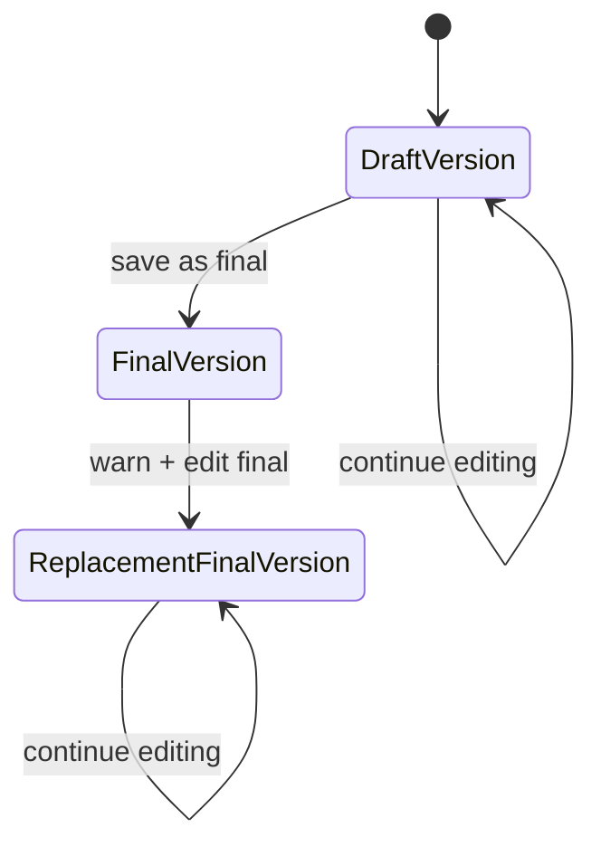

# Data Model: Monthly Report Draft and Final Workflow

**Feature**: 004-report-draft-workflow
**Date**: 2026-07-16
**Status**: Final

---

## Existing Models Used by This Feature

| Model | Key Fields Used | Notes |
|-------|-----------------|-------|
| `Site` | `id`, `name`, `external_id` | The monthly report is scoped to one site |
| `Supply` | `id`, `site`, `utility_type`, `device_id`, `name` | Report content continues to use the existing supply records |
| `HalfHourlyConsumption` | `supply`, `canonical_month_key`, `source_period_start`, `consumption` | Used if a report render needs existing monthly visual context |
| `MonthlyConsumption` | `supply`, `canonical_month_key`, `source_period_start`, `consumption` | Existing monthly consumption source data |
| `InvoiceCost` | `supply`, `canonical_month_key`, `cost` | Existing cost data source |
| `Benchmark` | `supply`, `canonical_month_key`, `value`, `unit` | Existing benchmark data source |

---

## New Schema Entities

### 1. `MonthlyReport`

Represents the one report identity for a given site and reporting month.

| Field | Type | Notes |
|-------|------|-------|
| `id` | UUIDField | Primary key |
| `site` | ForeignKey -> `Site` | Site scope for the report |
| `reporting_month` | CharField(7) | Canonical `YYYY-MM` month key |
| `current_status` | CharField | `draft` or `final` based on the latest saved version |
| `current_version` | ForeignKey -> `MonthlyReportVersion` | The version currently being edited or shown |
| `current_final_version` | ForeignKey -> `MonthlyReportVersion` | Latest final version used for client delivery |
| `created_at` | DateTimeField | Audit metadata |
| `updated_at` | DateTimeField | Audit metadata |

**Constraints**:
- Unique constraint on `(site, reporting_month)`.
- Index on `(site, reporting_month)` for browsing and reopen lookups.

**State meaning**:
- `draft` means the current editable version is not finalised.
- `final` means the latest saved version is client-facing.
- If a final report is edited after warning, `current_final_version` points to the newer replacement final version while the original final version remains stored.

---

### 2. `MonthlyReportVersion`

Stores immutable saved snapshots of a monthly report.

| Field | Type | Notes |
|-------|------|-------|
| `id` | UUIDField | Primary key |
| `report` | ForeignKey -> `MonthlyReport` | Parent monthly report identity |
| `version_number` | PositiveIntegerField | Monotonic per report |
| `version_kind` | CharField | `draft`, `final`, or `replacement_final` |
| `derived_from_version` | ForeignKey -> `MonthlyReportVersion`, null=True | Optional lineage to the prior version |
| `created_at` | DateTimeField | Audit metadata |
| `created_by` | ForeignKey -> `auth.User`, null=True | Optional actor metadata if the implementation stores it |

**Constraints**:
- Unique constraint on `(report, version_number)`.
- Index on `(report, version_kind)` for lookup of latest draft/final history.

**Behaviour**:
- Draft saves create draft versions.
- Final saves create final versions.
- Editing a final report after the warning creates a new `replacement_final` version.
- The original final version is never overwritten.

---

### 3. `ReportComment`

Stores one comment box entry for a specific visual section on a report version.

| Field | Type | Notes |
|-------|------|-------|
| `id` | UUIDField | Primary key |
| `report_version` | ForeignKey -> `MonthlyReportVersion` | Parent version |
| `visual_key` | CharField | Stable identifier for the visual/comment box |
| `text` | TextField | Free-form comment content |
| `is_reference_copy` | BooleanField | True when copied from the previous month's final report |
| `source_reporting_month` | CharField(7), null=True | Month copied from, if reference copy |
| `source_version` | ForeignKey -> `MonthlyReportVersion`, null=True | Version copied from, if reference copy |
| `created_at` | DateTimeField | Audit metadata |
| `updated_at` | DateTimeField | Audit metadata |

**Constraints**:
- Unique constraint on `(report_version, visual_key)` so each visual has one comment value per version.

**Behaviour**:
- Comments created during initial draft seeding may be marked as reference copies.
- Users can edit reference comments in the new month's report.
- Empty comment boxes are represented by blank text and no reference metadata.

---

## Derived / Read Models

### `SavedReportListItem`

Not persisted. Derived from `MonthlyReport` and its current version for the browsing page.

| Field | Source | Notes |
|-------|--------|-------|
| `site_name` | `MonthlyReport.site.name` | Display label |
| `reporting_month` | `MonthlyReport.reporting_month` | Month shown in the list |
| `status` | `MonthlyReport.current_status` | Draft or final |
| `updated_at` | `MonthlyReport.updated_at` | Sorting / freshness |
| `current_version_id` | `MonthlyReport.current_version` | Used to open the report |

---

## State Transitions

**Notes**:
- The monthly report identity stays the same across all transitions.
- The original final version remains persisted even when a replacement final is added.

---

## Migration Notes

The implementation will need a new migration to add the monthly report tables and constraints. The migration should remain reversible and additive.