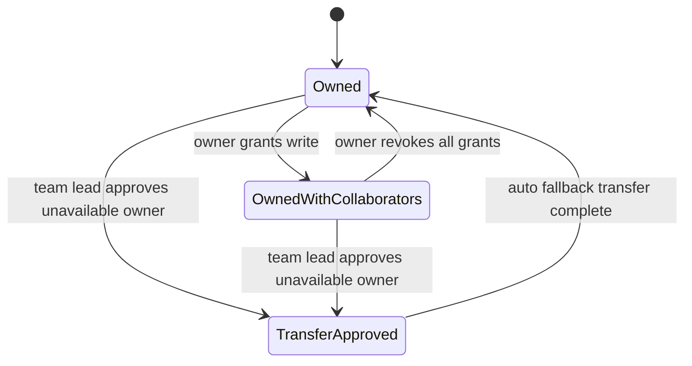

# Data Model: Report Ownership Model

Feature: 010-report-ownership-model  
Date: 2026-08-03  
Status: Draft

## Existing Models Reused

| Model | Relevant Fields | Purpose in this feature |
|---|---|---|
| Site | id, name | Report site scope anchor |
| MonthlyReport | id, site, reporting_month, current_status, created_at, updated_at | Core report identity to extend with ownership |
| Team | id, manager, team_lead, level, parent_team | Fallback hierarchy source |
| UserTeamAssignment | user, team | Team membership used for scope validation |
| RoleAssignment | user, role_name | Admin role fallback determination |

## Model Changes

### 1) MonthlyReport (modified)

Add ownership/accountability fields:

| Field | Type | Rules |
|---|---|---|
| owner_user | FK -> auth.User, nullable during migration only | Required for active reports after backfill |
| created_by_user | FK -> auth.User, nullable for historical records | Set on first report creation |
| last_modified_by_user | FK -> auth.User, nullable during migration only | Updated on each permitted write |
| last_modified_at | DateTimeField | Updated on each permitted write; initialized from created_at |

Constraints and indexes:
- Unique constraint remains on (site, reporting_month).
- Add index on owner_user.
- Add composite index on (site, owner_user, current_status) for saved-report listing and owner filtering.

Validation rules:
- owner_user must always be set after migration backfill.
- last_modified_at must be >= created_at.
- last_modified_by_user must be set when report content is mutated.

### 2) ReportWriteGrant (new)

Report-level named user write delegation.

| Field | Type | Rules |
|---|---|---|
| id | UUID PK | Immutable identity |
| report | FK -> MonthlyReport | Target report |
| granted_user | FK -> auth.User | Named collaborator with write access |
| granted_by | FK -> auth.User | Must be current owner at grant time |
| granted_at | DateTimeField | Auto timestamp |
| revoked_by | FK -> auth.User, nullable | Set on revoke |
| revoked_at | DateTimeField, nullable | Set on revoke |
| is_active | BooleanField, default true | Fast permission path |

Constraints and indexes:
- Unique active grant per (report, granted_user).
- Index on (report, is_active).
- Index on granted_user for access checks.

Validation rules:
- granted_user cannot equal report owner_user.
- Only owner can create or revoke grant.
- Revoked grant must set both revoked_by and revoked_at.

### 3) ReportOwnershipUnavailabilityApproval (new)

Workflow gate that authorizes fallback transfer initiation.

| Field | Type | Rules |
|---|---|---|
| id | UUID PK | Immutable identity |
| report | FK -> MonthlyReport | Report in question |
| owner_user | FK -> auth.User | Owner being marked unavailable |
| approved_by | FK -> auth.User | Must be team lead in report scope |
| approval_reason | TextField | Required non-empty reason |
| approved_at | DateTimeField | Trigger timestamp |
| status | CharField | approved or cancelled |

Constraints and indexes:
- Index on (report, status).
- Index on approved_at for audit queries.

Validation rules:
- approved_by must be active and role-qualified as team lead for report scope.
- Only approved records can trigger transfer execution.

### 4) ReportOwnershipTransferEvent (new)

Auditable ownership transition result.

| Field | Type | Rules |
|---|---|---|
| id | UUID PK | Immutable identity |
| report | FK -> MonthlyReport | Report transferred |
| from_owner | FK -> auth.User | Previous owner |
| to_owner | FK -> auth.User | New owner |
| transfer_mode | CharField | auto_fallback or manual_owner_transfer |
| transfer_reason | TextField | Captures workflow reason |
| approval_record | FK -> ReportOwnershipUnavailabilityApproval, nullable | Required for auto_fallback |
| transferred_at | DateTimeField | Timestamp |
| executed_by | FK -> auth.User, nullable | Null for system-run transfer |

Constraints and indexes:
- Index on (report, transferred_at).
- Index on (to_owner, transferred_at).

Validation rules:
- from_owner and to_owner must differ.
- transfer_mode auto_fallback requires approval_record.

## Derived Read Model

### SavedReportOwnershipRow

Projection for saved reports listing:
- report_name_or_site
- reporting_month
- owner_display
- created_at
- last_edited_by
- last_edited_at
- status
- can_current_user_edit

## Permission Resolution Rules

Write permission is granted if any of the following is true:
1. Current user equals MonthlyReport.owner_user.
2. Current user has active ReportWriteGrant for report.
3. Current user is platform admin and is using an explicit privileged workflow endpoint.

Read permission follows existing report visibility rules and remains broader than write permission.

## Ownership Fallback Algorithm

Given an approved unavailability record:
1. Build candidate list in strict order:
   - team_lead from the report scope team
   - manager from the report scope team
   - system admin in same scope
2. Candidate is available only if active, role-qualified, and assigned to same site or organization scope.
3. Choose first available candidate; if none found, keep owner unchanged and return actionable error.
4. Update MonthlyReport.owner_user to selected candidate.
5. Ensure previous owner retains active ReportWriteGrant unless separately revoked.
6. Write ReportOwnershipTransferEvent and update MonthlyReport.last_modified_by_user and last_modified_at.

## State Transitions

## Migration Notes

- Backfill MonthlyReport.owner_user from created_by_user when available; otherwise from a controlled migration fallback user.
- Initialize last_modified_at from existing updated_at and last_modified_by_user from owner_user where historical actor is unavailable.
- Keep migration additive and reversible.
- Validate all migration and tests via Docker Compose only.