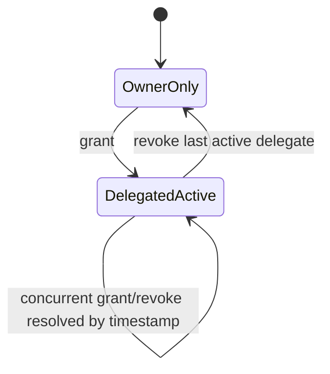

# Data Model: Report Write Delegation

Feature: 011-report-write-delegation  
Date: 2026-08-03  
Status: Draft

## Existing Models Reused

| Model | Relevant Fields | Purpose in this feature |
|---|---|---|
| MonthlyReport | id, site, reporting_month, owner_user, current_status | Delegation target and write authorization anchor |
| User | id, is_active | Delegation grantor and delegate identity |
| Team | id, team_lead, manager | Organisation/team scope authority for delegation |
| UserTeamAssignment | user, team | Same-team and organisation-scope eligibility checks |
| RoleAssignment | user, role_name | Authority checks where manager/team-lead roles are role-backed |

## Model Changes

### 1) ReportWriteDelegation (new)

Active delegation state for report-level writer access.

| Field | Type | Rules |
|---|---|---|
| id | UUID PK | Immutable identifier |
| report | FK -> MonthlyReport | Required delegation target |
| delegate_user | FK -> auth.User | User receiving write access |
| granted_by_user | FK -> auth.User | User who performed most recent grant |
| granted_by_role | CharField | owner, team_lead, manager |
| granted_at | DateTimeField | Server commit timestamp |
| revoked_by_user | FK -> auth.User, nullable | Last revoker when inactive |
| revoked_by_role | CharField, nullable | owner, team_lead, manager |
| revoked_at | DateTimeField, nullable | Server commit timestamp for revoke |
| is_active | BooleanField | True while write delegation is effective |

Constraints and indexes:
- Unique active delegation per (report, delegate_user).
- Index on (report, is_active) for access checks and listing.
- Index on (delegate_user, is_active) for current-user editable report discovery.

Validation rules:
- delegate_user must be active at grant time.
- delegate_user cannot be outside report organisation scope.
- owner grants require delegate_user in same team as owner.
- team_lead and manager grants require same organisation as report.
- delegate_user may equal grantor only for team_lead/manager self-delegation.

### 2) ReportWriteDelegationEvent (new)

Append-only audit trail for delegation lifecycle actions.

| Field | Type | Rules |
|---|---|---|
| id | UUID PK | Immutable identifier |
| report | FK -> MonthlyReport | Related report |
| delegate_user | FK -> auth.User | Delegated user |
| action | CharField | grant or revoke |
| action_by_user | FK -> auth.User | Actor that performed action |
| action_by_role | CharField | owner, team_lead, manager |
| action_at | DateTimeField | Server commit timestamp |
| correlation_key | UUID, nullable | Links conflicting concurrent actions if present |
| resolution_basis | CharField, nullable | last_write_wins_timestamp when conflict handling applied |
| notes | TextField, nullable | Optional reason/context |

Constraints and indexes:
- Index on (report, action_at).
- Index on (delegate_user, action_at).
- Index on (correlation_key) for conflict diagnostics.

Validation rules:
- Every grant/revoke must write an event.
- For concurrent opposing actions on same pair, both events persist.
- Conflict resolution basis must be recorded when concurrency resolution is applied.

## Derived Read Models

### EffectiveReportWriteAccess

For current user and report:
- can_write (bool)
- write_mode (owner, delegated_writer, read_only)
- authority_source (owner, direct_delegation)

Rules:
1. can_write = true if current user is report owner_user.
2. Else can_write = true if active ReportWriteDelegation exists for (report, current user).
3. Else can_write = false.

### ReportDelegationVisibilityRow

Displayed to users with report read access:
- delegate_user_display
- granted_by_display
- granted_by_role
- granted_at
- active_status

## Permission Resolution Rules

Grant authorization:
1. Report owner can grant same-team active users.
2. Team lead can grant any active user in same organisation, including self.
3. Manager can grant any active user in same organisation, including self.

Revoke authorization:
1. Report owner can revoke.
2. Original grantor can revoke.
3. Team lead/manager in same organisation can revoke.

Save authorization:
- Evaluated at report save submit time.
- If user is not owner and has no active delegation, save is rejected.

Concurrent grant/revoke conflict resolution:
- Last-write-wins by server commit timestamp for the same (report, delegate_user) pair.
- Both actions must be persisted in ReportWriteDelegationEvent.
- ReportWriteDelegation reflects the winning state.

## State Transitions

## Migration Notes

- Add new delegation tables as additive migrations.
- No ownership backfill required for this feature beyond existing ownership baseline.
- Add indexes in same migration set to keep permission checks performant.
- Validate migrations and data integrity inside Docker containers only.
