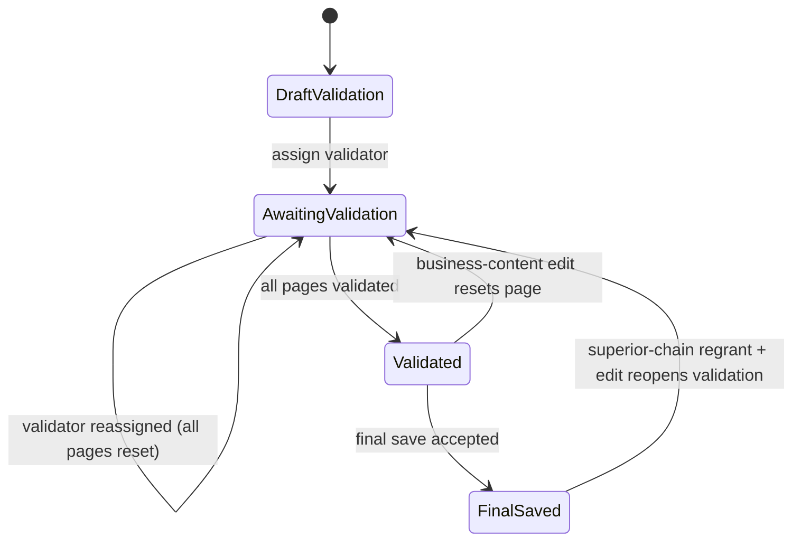

# Data Model: Report Validation Workflow

Feature: 012-report-validation-workflow  
Date: 2026-08-04  
Status: Draft

## Existing Models Reused

| Model | Relevant Fields | Purpose in this feature |
|---|---|---|
| MonthlyReport | id, site, reporting_month, current_status, owner_user, current_version, current_final_version | Validation target and finalization gate anchor |
| MonthlyReportVersion | id, report, version_kind, created_at | Version lineage used when save attempts are accepted or denied |
| ReportComment | report_version, visual_key, text | Existing business comment payload behavior retained |
| ReportWriteGrant | report, granted_user, is_active | Determines contributor write capability for edit-triggered validation reset |
| Team | id, team_lead, manager, parent_team | Eligibility checks for validator selection and supervisory-chain checks |
| UserTeamAssignment | user, team | Same-team and supervisory-chain eligibility checks |
| RoleAssignment | user, role_name | Role checks for lead/manager/admin authority paths |

## Model Changes

### 1) MonthlyReport (extend)

Add report-level validation metadata while preserving existing `current_status` (`draft`/`final`) behavior.

| Field | Type | Rules |
|---|---|---|
| validation_status | CharField | `draft`, `awaiting_validation`, `validated` |
| validator_user | FK -> auth.User, nullable | Current assigned validator |
| validator_assigned_by_user | FK -> auth.User, nullable | Actor who assigned current validator |
| validator_assigned_at | DateTimeField, nullable | Assignment timestamp |
| validated_by_user | FK -> auth.User, nullable | Validator who completed full validation |
| validated_at | DateTimeField, nullable | Timestamp when all pages became validated |
| validation_reopened_at | DateTimeField, nullable | Last time validation was reopened after edit/regrant |

Constraints and indexes:
- Index on `(validation_status)` for saved reports filtering and display.
- Index on `(validator_user, validation_status)` for validator work queue queries.

Validation rules:
- `validator_user` cannot equal `owner_user`.
- `validator_user` must be active and eligible (same team or supervisory chain of owner).
- `validated_by_user` must equal `validator_user` at the time status becomes `validated`.

### 2) ReportPageValidationState (new)

Stores per-page validation state for each report.

| Field | Type | Rules |
|---|---|---|
| id | UUID PK | Immutable identifier |
| report | FK -> MonthlyReport | Parent report |
| page_key | CharField | Stable page identifier (for each report page section) |
| is_validated | BooleanField | True when page is validated by current validator |
| validated_by_user | FK -> auth.User, nullable | Assigned validator who validated this page |
| validated_at | DateTimeField, nullable | Validation timestamp |
| reset_reason | CharField, nullable | `content_changed`, `validator_reassigned`, `final_reopened` |
| reset_at | DateTimeField, nullable | Last reset timestamp |

Constraints and indexes:
- Unique constraint on `(report, page_key)`.
- Index on `(report, is_validated)` for completeness checks.

Validation rules:
- Only current `validator_user` may set `is_validated=True`.
- When `validator_user` changes, all rows for report must reset to `is_validated=False`.
- Business-content edits on a page clear that page validation state.
- Validation-comment-only edits do not clear page validation state.

Page key canonicalization:
- `page_key` MUST come from the same canonical visual section key set used by report comment sections in the report editor.
- Only canonical keys present in the rendered report section registry are valid for page validation rows.
- Validation completeness is evaluated against all currently rendered canonical page keys for the report context.

### 3) ReportValidationComment (new)

Dedicated validation-comment channel per page, distinct from business comments.

| Field | Type | Rules |
|---|---|---|
| id | UUID PK | Immutable identifier |
| report | FK -> MonthlyReport | Parent report |
| page_key | CharField | Page this note belongs to |
| comment_text | TextField | Validation discussion content |
| authored_by_user | FK -> auth.User | Owner, contributor, or validator |
| updated_at | DateTimeField | Last edit timestamp |

Constraints and indexes:
- Unique constraint on `(report, page_key, authored_by_user)` if single latest note per user/page is desired, or remove for full thread model.
- Index on `(report, page_key)` for report view loading.

Validation rules:
- Author must have report visibility; write users can edit own validation comments.
- Validation-comment updates must never trigger page-validation reset.

### 4) ReportValidationEvent (new)

Append-only audit events for validation workflow actions.

| Field | Type | Rules |
|---|---|---|
| id | UUID PK | Immutable identifier |
| report | FK -> MonthlyReport | Related report |
| page_key | CharField, nullable | Set for page-scoped events |
| event_type | CharField | `validator_assigned`, `validator_reassigned`, `page_validated`, `page_reset`, `report_validated`, `final_blocked`, `final_reopened` |
| event_by_user | FK -> auth.User | Actor causing event |
| event_at | DateTimeField | Server commit timestamp |
| metadata | JSONField | Reason, previous/new state, and policy evidence |

Constraints and indexes:
- Index on `(report, event_at)`.
- Index on `(event_type, event_at)`.

Validation rules:
- Every assignment/reassignment, page validate/reset, report validated transition, and blocked final save writes one event.

## Derived Read Models

### ReportValidationSummary

For report header and saved reports metadata:
- validation_status
- validator_display
- validated_by_display
- validated_at
- validated_page_count
- total_page_count
- can_finalize

Rules:
- `can_finalize=True` only when `validation_status='validated'` and every page is validated.
- On reassignment or reopened final edit, `can_finalize=False` until all pages are revalidated.

### PageValidationViewRow

For each report page:
- page_key
- is_validated
- validated_by_display
- validated_at
- show_reset_warning
- validation_comment_thread

## State Transitions

## Migration Notes

- Additive migration extends `MonthlyReport` and introduces validation tables.
- Backfill existing reports with `validation_status='draft'` and null validator/validated fields.
- Keep existing `current_status` and versioning semantics intact for compatibility.
- Validate migrations and data integrity in Docker container only.
